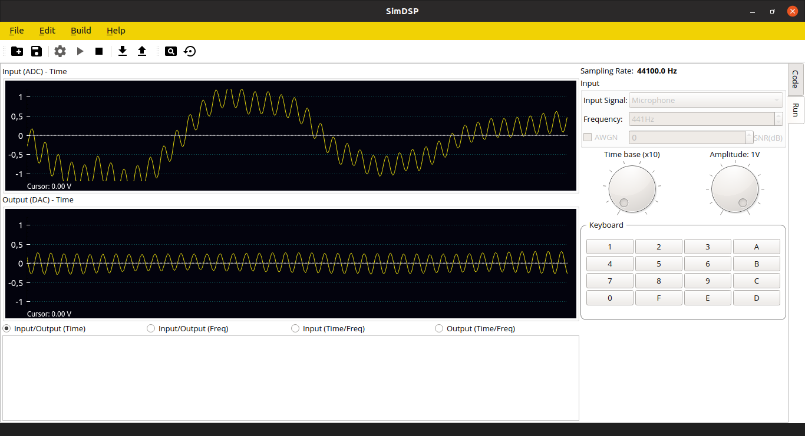

# SimDSP 

**Sim**ulation software for **D**igital **S**ignal **P**rocessing

SimDSP provides simulation of DSP algorithms written in C/C++ language by generating the necessary signals of 15-bit ADC and DAC. The programs under debugging must be written using the editor included in this software. It is not necessary to install any compiler for compiling or debugging purposes, since installers are boundle versions that includes editor, compiler 
and debugger. 

The signals that can be generated are: sinusoidal, square, triangular, data file (MatLAB format) and microphone input. Also, Gaussian additive noise (AWGN) can be included for the sine, square and triangular signals. If signals are acquired from microphone, only the following sampling frequencies are supported: 8000, 11025, 22050 and 44100Hz. 

Data acquisition and processing can be performed on the sample-by-sample approach or block-oriented approach (DMA framework). For microphone mode, only block-oriented approach is available. The signals can be displayed in time or in the frequency domain.

# Installation

This software is available for Windows and Linux platforms. For each platforms uncompress the respective file (.zip or .tar).
For Linux you can also use the AppImage image, also available through [https://appimage.github.io/SimDSP/](https://appimage.github.io/SimDSP/)

## Execution

Once the program is uncompressed, run SimDSP.exe or SimDSP, depending on your platform.

# Credits

The core team consists of Luis Miguel Capacho Valbuena, Jorge Iván Marín Hurtado, and Alexander López Parrado. (c) 2017 - Universidad del Quindío. Armenia, Quindio, Colombia. 

The SimDSP app is written on top of the [Qt cross-platform framework](http://qt-project.org).

# Licensing

This software is available under an open source GNU license available on [GitHub](https://github.com/lmcapacho/SimDSP).
